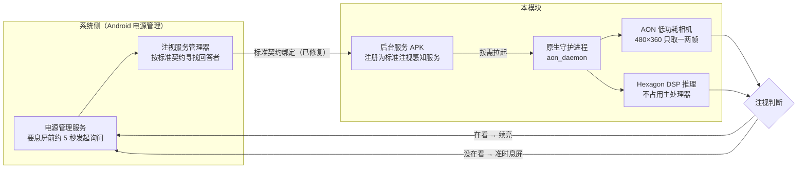

# Lenovo Legion Y900 (TB522FU) 注视不熄屏增强模块

联想拯救者 Y900 的前置有一颗专门的"注视感知"小摄像头（不是普通前摄，不占用相机功能），硬件本身完全支持注视检测，系统设置里也有「注视时不熄屏」这个开关。但在移植版 ColorOS 上，**这个开关打开后并不起作用**——系统里缺少把它接通的那段逻辑。本模块补上了这一段，让原装硬件真正感知是否注视，并根据设置决定是否息屏：

- 快要熄屏的前几秒，快速检测你是否还盯着屏幕 → **在看，就继续亮着**
- 你走开、扭头了 → 准时变暗熄屏，一秒不浪费
- 平时摄像头**完全断电**，只在需要判断的瞬间（不到半秒）短暂工作一下，几乎不增加耗电

---

## 方案对比

这台设备的注视感知摄像头先后有三种软件方案，效果差别很大：

|          | 联想原厂                               | 底包自带的 LwKy（凝光）                            | 本模块                                           |
| -------- | ---------------------------------- | ----------------------------------------- | --------------------------------------------- |
| 注视不熄屏能否用 | ❌ 原厂方案里这个功能没接通，只在别的功能（AI 眼动多窗）用摄像头 | ⚠️ 有这套逻辑，但配置有缺陷，在本 ROM 上**容易引发系统崩溃和异常耗电** | ✅ 端到端接通，真机实测可用                                |
| 工作方式     | 摄像头持续输出眼动坐标（常驻）                    | 靠监听系统日志触发检测                               | 只在"快要熄屏的那几秒"按需探测，看完立刻断电                       |
| 稳定性      | 稳定（但功能没用上）                         | 可能的配置错误会让协处理器芯片反复崩溃重启，一夜掉电严重              | 稳定：芯片出异常自动断电隔离，服务退出自动拉起，连续 3 次开机失败自动禁用模块并还原设置 |
| 耗电       | —                                  | 较高（崩溃循环期间）                                | 很低：整夜实测几乎无感（后台服务整夜 <0.2 mAh）                  |
| 开源可维护    | ❌ 闭源                               | ❌ 不可控、不可改                                 | ✅ 全开源，附完整技术文档，换 ROM 也大概率能用                    |

> **关于之前出现过的整夜异常掉电**：经排查，大概率是方案二里一处相机配置缺陷（触发了摄像头协处理器的崩溃循环）导致的。本模块每次开机都会把这处配置修正为安全值，并带有多重防护。连续多晚的整夜实测未再复现——不过耗电受信号、后台应用、环境温度等多种因素影响，不能保证在所有场景下都完全没有其他耗电来源。

---

## 🌟 核心特性

1. **让系统设置里的开关真正生效**：设置 → 显示与亮度 → 注视时不熄屏，打开后看屏幕续亮、离开准时息屏，不再是摆设。
2. **几乎零耗电**：平时摄像头 100% 断电；只在快熄屏的瞬间探测一两帧，答完立即关闭，不给续航添负担。
3. **多重保护，不怕出问题**：
   - 感知芯片出现异常 → 自动断电隔离，防止崩溃循环（历史上曾有一夜掉电 80% 的事故形态，现在有熔断保护）；
   - 后台服务意外退出 → 自动重新拉起；
   - 连续 3 次开机失败 → 模块自动禁用自己并还原全部设置，不会把设备变砖，在管理器里重新启用即可。
4. **手机上直接控制**：KernelSU 等管理器内置控制台（WebUI），开关、测试、调参数一屏搞定，横竖屏都适配。
5. **日志默认关闭**：日志会持续写入、长期积累会占存储，所以默认不记录。需要排查问题时在 WebUI 里手动打开（开启后界面会提醒你记得关），用完关闭即可；关闭状态下仍可查看和清空历史日志。

---

## 📦 安装

1. 设备已解锁 BL，并装有 KernelSU / ReSukiSU / APatch / Magisk 等管理器。
2. 从 [Releases](https://github.com/futureharmony/Lenovo-TB522FU-Attention-KeepOn/releases) 下载最新的 zip（也可自己构建：`./build_zip.sh`）。
3. 管理器 → 模块 → 本地安装 → 重启即可。安装脚本会自动做**三项兼容性自检**（SystemUI 原厂注视组件 / island 配置 / AON 硬件通道），全部通过会显示"✓ 兼容性自检全部通过"；任一异常会在安装日志中明确警告——模块仍会安装，但注视功能可能无效。

装好后到 **设置 → 显示与亮度 → 注视时不熄屏** 打开开关，就能用了。

---

## 🖥️ 使用

### WebUI 控制台（推荐）

在管理器里点本模块的卡片即可打开：

- **主开关 + 状态指标**：服务是否在跑、系统有没有接通、屏幕状态、电流，一目了然。
- **一键测试**：点「测试」按钮立即做一次注视检测，几秒内告诉你"能不能看到你"（等待期间按钮有转圈动效和实时秒数，界面不会卡住，可正常操作其他开关）。
- **感知行为**：按需判定、严格注视（必须看着屏幕才算）、注视丢失宽限等，改动实时生效。
- **高级 AON 参数**：事件掩码、算法、分辨率、帧率，每项都有**合法范围校验和用法说明**（点开"❓ 各参数的用法与可用范围"查看），非法输入不会被应用。
- **日志记录**：默认关闭，排查问题时打开开关（开启后会出现醒目提醒横幅），用完记得关。开启后看到的是一条**统一时间线**——模块脚本、后台服务、系统框架三个来源的日志按时间排序混排，每行前缀 `[模块]` / `[服务]` / `[框架]` 标明出处。
- **日志导出**：点「⬇️ 导出到下载」把全部日志（含设备信息头）保存到 `内部存储/Download/AttentionKeepOn-log-<时间戳>.log`，成功后界面会提醒保存位置；「清空」会把三个来源一起清掉。

### 命令行（root，可选）

```bash
attention_ctrl status       # 查看状态
attention_ctrl on|off       # 开 / 关
attention_ctrl test         # 单次注视检测
attention_ctrl bind         # 重新绑定系统服务（开关失效时可以试试）
attention_ctrl log [n]      # 查看最近 n 行统一日志（三来源按时间排序）
attention_ctrl export       # 导出全部日志到 /sdcard/Download/
attention_ctrl set <k> <v>  # 修改配置项（数值项带范围校验，非法值拒绝）
```

### 两个常见疑问

- **锁屏状态下不生效？** 正常现象——按系统设计，注视检测只在普通亮屏（非锁屏）时工作。
- **开关又失效了？** 打开 WebUI 看「绑定」指示灯：如果是灰的，点一下终端执行 `attention_ctrl bind`，或者直接重启手机即可（模块开机时会自动重新绑定）。

---

## 🛠️ 技术规格

本模块面向联想拯救者 Y900（TB522FU，骁龙 8 Elite / ColorOS 16 移植版 / Android 16），整体方案由四层组成：**系统接入层**通过 AOSP 标准契约把我们的服务注册给电源管理；**感知层**驱动前置 AON 低功耗相机完成注视判断；**运维层**负责配置修正、崩溃熔断、服务保活与开机回退；**交互层**提供 WebUI 控制台。工作流程如下图：



### 四个组成部分

1. **系统接入层 —— 无界面后台服务（aon.apk）+ 框架声明（framework-res overlay）**：实现 AOSP 标准的 AttentionService 契约，系统电源管理在准备熄屏前约 5 秒主动来"问"是否有人注视，我们在回调窗口内完成检测并回答 PRESENT（在看）/ ABSENT（没在看）。这一层由两块承重件组成，缺一不可：模块 APK 必须声明契约要求的绑定权限（缺了它框架会直接丢弃我们的服务，即"开关打开却不起作用"的根因）；模块还带一个 framework-res 覆盖（overlay），把系统默认注视服务声明指向原厂组件——系统设置靠它校验"这个功能可不可用"，框架靠它决定要不要发布注视服务通道。后者曾一度被误判为冗余而移除、导致开关再次失效，现已恢复并部署在安装流程里。
2. **感知层 —— 原生守护进程（aon_daemon）**：直接驱动前置 AON 专用低功耗相机（Camera 3 / OG0VE，480×360 模式），感知推理跑在专用 Hexagon DSP 上，不占用主处理器、不影响普通相机。相机平时 100% 断电，只在被问到的瞬间工作不到半秒。本层的安全前提是关键配置 **`is_island=0`**（见下文）。
3. **运维层 —— 开机脚本 + 守护脚本**：开机自动把可能导致协处理器崩溃循环的相机配置（is_island）修正为安全值，并在运行期持续盯防；服务意外退出自动拉起、系统绑定漂移自动重连；连续 3 次开机失败自动禁用模块并还原全部设置。
4. **交互层 —— WebUI 控制台**：在 KernelSU 等管理器里点模块卡片即可打开，开关、测试、调参、日志一屏搞定，横竖屏适配。

### 关键配置决策：`is_island=0`（禁用低功耗岛路径）

AON 相机在 DSP 侧有两条执行路径，由一个叫 `is_island` 的配置开关决定：

|             | `is_island=1`（低功耗岛路径）                                                | `is_island=0`（主域路径，**本模块采用**）               |
| ----------- | -------------------------------------------------------------------- | ------------------------------------------- |
| 执行位置        | ADSP 低功耗岛（EAI island），一个为省电设计的独立小执行域                                 | ADSP Hexagon 主域                             |
| 本机固件表现      | 这条路径在当前固件上存在跨执行域调用缺陷，**必然触发崩溃**，并引发约 5 秒一次的协处理器自持重启风暴（历史上曾致一夜掉电 80%） | 实测连续 10 个冷启动周期零崩溃，稳定                        |
| 底包 / LwKy   | 用的就是这个值（崩溃与异常掉电的根源）                                                  | 被底包配置放弃了                                    |
| 联想原厂 ZUX OS | 配置上写的是 1，但其注视功能走的是另一条天然不进岛的代码路径，实际不受此开关影响                            | **静态检测显示原厂也不使用**——`is_island=0` 并非原厂启用的运行模式 |

需要特别说明的是：**联想原厂 ZUX OS 经过我们的静态检测也没有使用 `is_island=0`，说明原生方案并不支持 island=0 模式**——它是我们通过逐项对照实验（切换唯一变量 `is_island`，崩溃随之出现/消失）验证出的安全替代路径，而不是厂商官方支持的用法。这也是模块必须在每次开机把厂商配置修正为 0、并在运行期持续盯防的原因：一旦 OTA 或恢复出厂让配置回归 1，崩溃风暴就会复发。

完整取证链路见 [`docs/PROJECT_HISTORY.md`](docs/PROJECT_HISTORY.md)（崩溃根因判决）与 [`docs/zux_gd_vs_island0_verdict_20260917.md`](docs/zux_gd_vs_island0_verdict_20260917.md)（原厂方案 vs island=0 优劣判决）。

**配置与数据**：配置存于 `/data/adb/tb522fu_attention/config.json`（所有数值项带合法范围校验，非法值会被前后端双重拒绝）。日志默认关闭（WebUI 可手动开启）；开启后模块写入同目录 `attention.log` 并自动轮转，App 服务写自身私有目录的 `aon.log`（受系统权限限制无法直接写前者）——WebUI 展示与导出时会把两个文件加上系统框架日志**按时间戳归并成一条统一时间线**，来源用前缀区分，不会无限占用存储。

**兼容性**：只依赖 AOSP 标准接口和厂商固件行为，不绑定某一特定 ROM——换其他移植系统大概率也能用。

---

## 📚 技术文档

逆向与取证的全部过程记录在 [`docs/`](docs/)（**索引先读 [`docs/README.md`](docs/README.md)**）：

| 文档                                                                                                                             | 回答什么                                |
| ------------------------------------------------------------------------------------------------------------------------------ | ----------------------------------- |
| [`docs/PROJECT_HISTORY.md`](docs/PROJECT_HISTORY.md)                                                                           | **项目总汇**：崩溃机制最终判决、修复与实测、18 条已作废结论清单 |
| [`docs/PITFALLS.md`](docs/PITFALLS.md)                                                                                         | 逆向取证时**哪些判据会骗人**（每条都曾给过错误结论）        |
| [`docs/github_module_vs_native_verdict_20260917.md`](docs/github_module_vs_native_verdict_20260917.md)                         | 联想原生方案与本模块的逐项对照 + 实机 A/B 实验         |
| [`docs/zux_attentive_display_why_not_crash_verdict_20260917.md`](docs/zux_attentive_display_why_not_crash_verdict_20260917.md) | 原厂 ROM 为什么"不崩"                      |
| [`docs/aon_session_lost_verdict_20260917.md`](docs/aon_session_lost_verdict_20260917.md)                                       | 一次自我纠错记录：Demand Mode 空闲态不是故障        |
| [`QSH_AON_FIRMWARE_BUG_REPORT.md`](QSH_AON_FIRMWARE_BUG_REPORT.md)                                                             | 提交给固件 / 平台侧的缺陷报告                    |

> 文档是**当时的取证快照**，被判"已作废"的结论按原样保留（用于说明错误怎么发生）。判断当前有效结论以 `PROJECT_HISTORY.md` 为准。

---

## 📁 仓库结构

```
magisk_module/        # 模块本体（含预编译 aon.apk / aon_daemon.bin / WebUI）
app/                  # 无头 APK 源码（Kotlin）与构建脚本
aon_ulp_probe/        # AON 硬件探针与逆向笔记
docs/                 # 技术文档：故障取证、方案判决、坑清单
build_zip.sh          # 模块打包脚本（版本号从 module.prop 单一来源读取）
.github/workflows/    # CI：语法检查 + tag 自动发版
```
